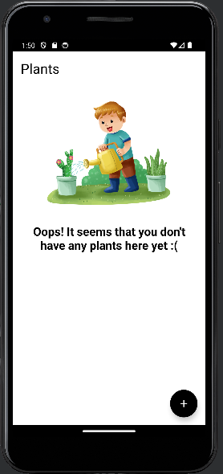
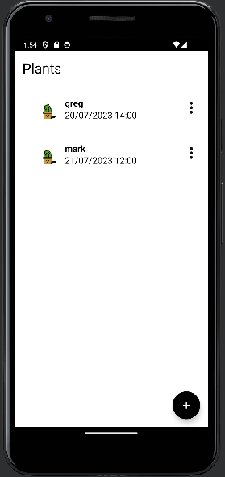
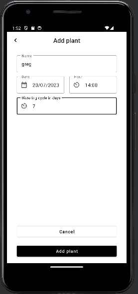
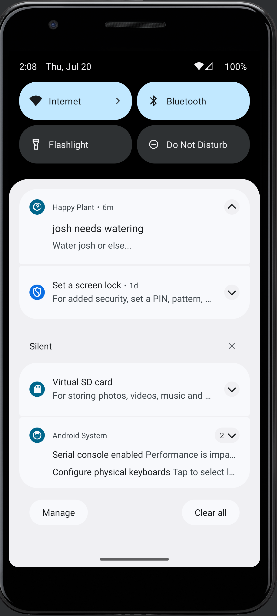

# Happy Plant

## Plant watering reminder app
Happy plant is an app that lets you properly take care of you precious plants.
With our app you will never forget to water your plants.
All you need to do is just download our app and add all of your plants - 
name them, set the watering period, date of the first watering, and you are all set!

## Notifications
Our app will send you a notification within 15 minutes of your plants watering due date.
The 15 minutes waiting period is due to a limitation of periodic background work in android, but
I am sure it will not affect your watering rhythm!

## Technologies

- Kotlin
- Android Studio 
- Google material
- ViewBinding with date picker
- Timer picker
- Recyclerview
- WorkManager

## Visuals
### Main screen without tasks

### Main screen with tasks

### Add task screen

### Notification

